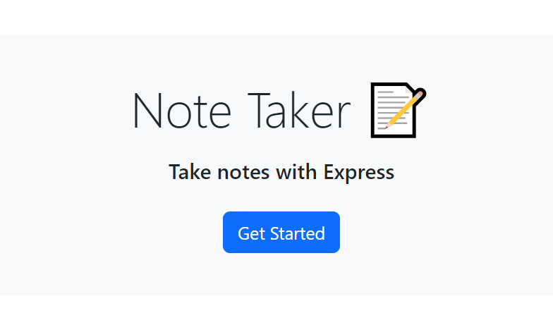
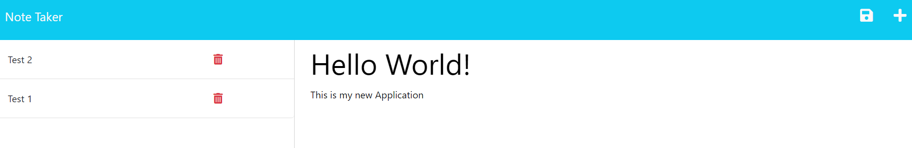

# Note Taker App

## Table of Contents
- [Description](#description)
- [Usage](#usage)
- [License](#license)
 

## Description
This is an application used to write down and save/delete notes. This application uses Express and Heroku for deployment using GET, POST, and DELETE routes.
 

## Usage
When you first load up the application you will be met with the Title of the application, a short description and a button that will take you to the notes page.  

 

Once you click 'Get Started' the page will redirect to the Notes Application. Here you can write the title of the note, the text content and then save it using the floppy disc icon at the top right. You can also delete previous notes using the trash bin icon.  

  

## License
The code in this project is licensed under MIT license.